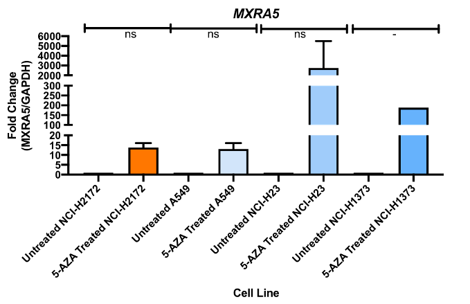

```{r setup, include=FALSE}
require(tidyverse)
require(extrafont)

knitr::opts_chunk$set(echo = TRUE)
```

## Keep the default theme in `default.theme`

```{r}
default.theme <- theme_get()
```


## A Simple Barplot

To make a barplot like the example below:



In essence, we need to change the following graphical attributes:

- Thickness of axes

- Ticks of y-axis

- Font type

- Bold font

- Color of filled bars

## Code

I will use the `storms` dataset to illustrate how to make a plot like the example above. The example plot shows the number of storms for each `status`. 

Take a look at the data:

```{r storms}
require(tidyverse)

glimpse(storms)
```

The standard `ggplot2` way to create barplot is

```{r}
ggplot(data = storms) +
  geom_bar(mapping = aes(x = status))
```

## The pretty version of the standard `barplot`.

The first step is to install the package `extrafont`. Right after installation, import fonts to your machine. You only need to do this step once. Notice that the fonts imported are machine-dependent.

```{r}
if (!( "extrafont" %in% .packages())) {
  
  require(extrafont)
  
  font_import(prompt = F)
  loadfonts(quiet = T)
}
```

Use different color to fill the bar and change the outline to thick black.

```{r}
ggplot(data = storms) +
  geom_bar(mapping = aes(x = status, fill = status), color = 'black', size = 2)
```

Choose a differnt color palette. The concept of palette can be found here: https://www.r-bloggers.com/colorspace-new-tools-for-colors-and-palettes/


```{r}
ggplot(data = storms) +
  geom_bar(mapping = aes(x = status, fill = status), color = 'black', size = 2) +
  scale_fill_brewer(palette = 'Set2')
```

Use another palette

```{r}
ggplot(data = storms) +
  geom_bar(mapping = aes(x = status, fill = status), color = 'black', size = 2) +
  scale_fill_brewer(palette = 'Cold')
```


Here is a map of palettes from https://i2.wp.com/eeecon.uibk.ac.at/~zeileis/assets/posts/2019-01-14-colorspace/hcl-palettes-1.png?ssl=1


Remove grid line and grey background.

```{r}
ggplot(data = storms) +
  geom_bar(mapping = aes(x = status, fill = status), color = 'black', size = 2) +
  scale_fill_brewer(palette = 'Set2') +
  theme(
    panel.grid = element_blank(),
    panel.background = element_blank()
  )
```

Change the thickness of x and y axes. Thickness of ticks is matched as well.

For customizing tick marks and labels, read this http://www.sthda.com/english/wiki/ggplot2-axis-ticks-a-guide-to-customize-tick-marks-and-labels


```{r}
ggplot(data = storms) +
  geom_bar(mapping = aes(x = status, fill = status), color = 'black', size = 2) +
  scale_fill_brewer(palette = 'Set2') +
  labs(title = 'Pretty Barplot', x = 'Status', y = 'Count') +
  theme(
    panel.grid = element_blank(),
    panel.background = element_blank(),
    text = element_text(family = 'Arial', size = 18),
    plot.title = element_text(hjust = 0.5), # [0, 1],
    axis.line = element_line(size = 1, linetype = 'solid'),
    axis.ticks = element_line(size = 1),
    axis.text.x = element_text(face = 'bold', angle = 45, vjust = 0.5, size = 10)
  ) +
  scale_y_continuous(breaks=seq(0, 4500, 500)) # _discrete means nominal, _continuous means numeric, 
```

Hide legend variable.

```{r}
ggplot(data = storms) +
  geom_bar(mapping = aes(x = status, fill = status), color = 'black', size = 2) +
  scale_fill_brewer(palette = 'Set2') +
  labs(title = 'Pretty Barplot', x = 'Status', y = 'Count') +
  theme(
    panel.grid = element_blank(),
    panel.background = element_blank(),
    text = element_text(family = 'Arial', size = 18),
    plot.title = element_text(hjust = 0.5), # [0, 1],
    axis.line = element_line(size = 1, linetype = 'solid'),
    axis.ticks = element_line(size = 1),
    axis.text.x = element_text(face = 'bold', angle = 45, vjust = 0.5, size = 10),
    legend.title = element_blank()
  ) +
  scale_y_continuous(breaks=seq(0, 4500, 500)) # _discrete means nominal, _continuous means numeric, 
```

As the labels beneath the bars have already told us the status, the legend is unnecessary. To remove the legend, set `legend.position = "None"`.

```{r}
ggplot(data = storms) +
  geom_bar(mapping = aes(x = status, fill = status), color = 'black', size = 2) +
  scale_fill_brewer(palette = 'Set2') +
  labs(title = 'Pretty Barplot', x = 'Status', y = 'Count') +
  theme(
    panel.grid = element_blank(),
    panel.background = element_blank(),
    text = element_text(family = 'Arial', size = 18),
    plot.title = element_text(hjust = 0.5), # [0, 1],
    axis.line = element_line(size = 1, linetype = 'solid'),
    axis.ticks = element_line(size = 1),
    axis.text.x = element_text(face = 'bold', angle = 45, vjust = 0.5, size = 10),
    legend.position = "None"
  ) +
  scale_y_continuous(breaks=seq(0, 4500, 500)) # _discrete means nominal, _continuous means numeric, 
```

Change the width of bars using `width=`. It ranges from 0 to 1, default is 1.

```{r}
ggplot(data = storms) +
  geom_bar(mapping = aes(x = status, fill = status), color = 'black', size = 2, width = 0.5) +
  scale_fill_brewer(palette = 'Set2') +
  labs(title = 'Pretty Barplot', x = 'Status', y = 'Count') +
  theme(
    panel.grid = element_blank(),
    panel.background = element_blank(),
    text = element_text(family = 'Arial', size = 18),
    plot.title = element_text(hjust = 0.5), # [0, 1],
    axis.line = element_line(size = 1, linetype = 'solid'),
    axis.ticks = element_line(size = 1),
    axis.text.x = element_text(face = 'bold', angle = 45, vjust = 0.5, size = 10),
    legend.position = "None"
  ) +
  scale_y_continuous(breaks=seq(0, 4500, 500)) # _discrete means nominal, _continuous means numeric, 
```

Make a horizontal barplot by `coord_flip()`.

```{r}
ggplot(data = storms) +
  geom_bar(mapping = aes(x = status, fill = status), color = 'black', size = 2, width = 0.5) +
  scale_fill_brewer(palette = 'Set2') +
  labs(title = 'Pretty Barplot', x = 'Status', y = 'Count') +
  theme(
    panel.grid = element_blank(),
    panel.background = element_blank(),
    text = element_text(family = 'Arial', size = 18),
    plot.title = element_text(hjust = 0.5), # [0, 1],
    axis.line = element_line(size = 1, linetype = 'solid'),
    axis.ticks = element_line(size = 1),
    axis.text.x = element_text(face = 'bold', angle = 45, vjust = 0.5, size = 10),
    legend.position = "None"
  ) +
  scale_y_continuous(breaks=seq(0, 4500, 500)) +
  coord_flip()
```

## Barplot with error bars

Let's use the `iris` dataset for illustration.

```{r}
glimpse(iris)
```

```{r}
Sepal.Length.summ <- iris %>%
  select(Sepal.Length, Species) %>%
  group_by(Species) %>%
  summarise(se = sd(Sepal.Length), u = mean(Sepal.Length))
glimpse(Sepal.Length.summ)
```

A very basic barplot with error bar. Note that the statistical transformation is changed to identity (`stat = 'identity'`), i.e. take the face values.

```{r}
ggplot(data = Sepal.Length.summ) +
  geom_bar(mapping = aes(Species, y = u), stat = 'identity') +
  geom_errorbar(mapping = aes(x = Species, ymin = u-se, ymax = u+se))
```

Make a pretty one.

```{r}
ggplot(data = Sepal.Length.summ) +
  geom_bar(mapping = aes(x = Species, y = u, fill = Species), stat = 'identity', color = 'black', size = 2, width = 0.5) +
  geom_errorbar(mapping = aes(x = Species, ymin = u-se, ymax = u+se), width = 0.3, size=1) +
  scale_fill_brewer(palette = 'Set2') +
  labs(title = 'Barplot with Error Bar', x = 'Species', y = 'Sepal Length (cm)') +
  theme(
    panel.grid = element_blank(),
    panel.background = element_blank(),
    text = element_text(family = 'Arial', size = 18),
    plot.title = element_text(hjust = 0.5), # [0, 1],
    axis.line = element_line(size = 1, linetype = 'solid'),
    axis.ticks = element_line(size = 1),
    # axis.text.x = element_text(face = 'bold', angle = 45, vjust = 0.5, size = 10),
    legend.position = "None"
  )
```

## Multipanel plot

Data preparation.

```{r}
tmp.summ <- iris %>%
  group_by(Species) %>%
  summarise(sl.se = sd(Sepal.Length), sl.u = mean(Sepal.Length),
            sw.se = sd(Sepal.Width), sw.u = mean(Sepal.Width),
            pl.se = sd(Petal.Length), pl.u = mean(Petal.Length),
            pw.se = sd(Petal.Width), pw.u = mean(Petal.Width)
  )
sw.summ <- tmp.summ %>%
  select(Species, sw.se, sw.u) %>%
  mutate(Part = 'Sepal.Width') %>%
  rename(se = sw.se, u = sw.u)

sl.summ <- tmp.summ %>%
  select(Species, sl.se, sl.u) %>%
  mutate(Part = 'Sepal.Length') %>%
  rename(se = sl.se, u = sl.u)

pw.summ <- tmp.summ %>%
  select(Species, pw.se, pw.u) %>%
  mutate(Part = 'Petal.Width') %>%
  rename(se = pw.se, u = pw.u)

pl.summ <- tmp.summ %>%
  select(Species, pl.se, pl.u) %>%
  mutate(Part = 'Petal.Length') %>%
  rename(se = pl.se, u = pl.u)

all.summ <- bind_rows(sw.summ, sl.summ)
all.summ <- bind_rows(all.summ, pw.summ)
all.summ <- bind_rows(all.summ, pl.summ)


glimpse(all.summ)
```

Just plot the `Sepal.Width`.

```{r}
ggplot(data = sw.summ) +
  geom_bar(mapping = aes(x = Species, y = u, fill = Species), stat = 'identity', color = 'black', size = 2, width = 0.5) +
  geom_errorbar(mapping = aes(x = Species, ymin = u-se, ymax = u+se), width = 0.3, size=1) +
  scale_fill_brewer(palette = 'Set2') +
  labs(title = 'Barplot with Error Bar', x = 'Species', y = 'Sepal Width (cm)') +
  theme(
    panel.grid = element_blank(),
    panel.background = element_blank(),
    text = element_text(family = 'Arial', size = 18),
    plot.title = element_text(hjust = 0.5), # [0, 1],
    axis.line = element_line(size = 1, linetype = 'solid'),
    axis.ticks = element_line(size = 1),
    # axis.text.x = element_text(face = 'bold', angle = 45, vjust = 0.5, size = 10),
    legend.position = "None"
  )

```

## Combination a boxplot 

```{r}
ggplot(data = all.summ) +
  geom_bar(mapping = aes(x = Species, y = u, fill = Species), stat = 'identity', color = 'black', size = 2, width = 0.5) +
  geom_errorbar(mapping = aes(x = Species, ymin = u-se, ymax = u+se), width = 0.3, size=1) +
  scale_fill_brewer(palette = 'Set2') +
  labs(title = 'Barplot with Error Bar', x = 'Species', y = 'Length or Width (cm)') +
  theme(
    panel.grid = element_blank(),
    panel.background = element_blank(),
    text = element_text(family = 'Arial', size = 18),
    plot.title = element_text(hjust = 0.5), # [0, 1],
    axis.line = element_line(size = 1, linetype = 'solid'),
    axis.ticks = element_line(size = 1),
    axis.text.x = element_text(face = 'bold', angle = 45, vjust = 0.5, size = 8),
    legend.position = "None"
  ) +
  facet_grid( ~ Part)

```

Make the facet into 2x2 using `facet_wrap(...)` instead of `facet_grid(...)`.

```{r}
ggplot(data = all.summ) +
  geom_bar(mapping = aes(x = Species, y = u, fill = Species), stat = 'identity', color = 'black', size = 2, width = 0.5) +
  geom_errorbar(mapping = aes(x = Species, ymin = u-se, ymax = u+se), width = 0.3, size=1) +
  scale_fill_brewer(palette = 'Set2') +
  labs(title = 'Barplot with Error Bar', x = 'Species', y = 'Length or Width (cm)') +
  theme(
    panel.grid = element_blank(),
    panel.background = element_blank(),
    text = element_text(family = 'Arial', size = 18),
    plot.title = element_text(hjust = 0.5), # [0, 1],
    axis.line = element_line(size = 1, linetype = 'solid'),
    axis.ticks = element_line(size = 1),
    axis.text.x = element_text(face = 'bold', angle = 45, vjust = 0.5, size = 8),
    legend.position = "None"
  ) +
  facet_wrap( ~ Part, ncol = 2)

new_th <- theme_bw()
```


## Line graph with error bar. Basically, it is a combination of points with a line connecting a pair of points. Notice that `geom_line(aes(group=1))`. The `aes(group=1)` is to allow the line to span three species.


```{r}
ggplot(data = all.summ, mapping = aes(x = Species, y = u)) +
  geom_line(aes(group=1)) +
  geom_point(size = 2) +
  geom_errorbar(mapping = aes(ymin = u-se, ymax = u+se), width = 0.1, size=1) +
  scale_fill_brewer(palette = 'Set2') +
  labs(title = 'Line plot with Error Bar', x = 'Species', y = 'Length or Width (cm)') +
  theme(
    panel.grid = element_blank(),
    panel.background = element_blank(),
    text = element_text(family = 'Arial', size = 18),
    plot.title = element_text(hjust = 0.5), # [0, 1],
    axis.line = element_line(size = 1, linetype = 'solid'),
    axis.ticks = element_line(size = 1),
    axis.text.x = element_text(face = 'bold', angle = 45, vjust = 0.5, size = 8),
    legend.position = "None"
  ) +
  facet_wrap( ~ Part, ncol = 2)

```

## Boxplot with individual data points (jitter plot)


Just for `Sepal.Length`. Points in `jitter(...)` are enlarged (`size=4`). The width of the box is 50% of default.

```{r}
ggplot(data = select(iris, Species, Sepal.Length), mapping = aes(x = Species, y = Sepal.Length, color = Species)) +
  scale_fill_brewer(palette = 'Set2') +
  geom_jitter(size=4) +
  geom_boxplot(alpha=0.5, width=0.5, color='black') +
  theme(
    panel.grid = element_blank(),
    panel.background = element_blank(),
    text = element_text(family = 'Arial', size = 18),
    plot.title = element_text(hjust = 0.5), # [0, 1],
    axis.line = element_line(size = 1, linetype = 'solid'),
    axis.ticks = element_line(size = 1),
    axis.text.x = element_text(face = 'bold', vjust = 0.5, size = 8),
    legend.position = "None" 
  )
```

Jitter plot with a median line

```{r}
ggplot(data = select(iris, Species, Sepal.Length), mapping = aes(x = Species, y = Sepal.Length)) +
  geom_jitter() +
  stat_summary(fun.y = median, fun.ymin = median, fun.ymax = median, geom = 'crossbar', width=0.5)

```

```{r}
ggplot(data = select(iris, Species, Sepal.Length), mapping = aes(x = Species, y = Sepal.Length, color = Species)) +
  scale_fill_brewer(palette = 'Set2') +
  geom_jitter(size=4) +
  stat_summary(fun.y = median, fun.ymin = median, fun.ymax = median, geom = 'crossbar', width=0.5, color = 'Black') +
  theme(
    panel.grid = element_blank(),
    panel.background = element_blank(),
    text = element_text(family = 'Arial', size = 18),
    plot.title = element_text(hjust = 0.5), # [0, 1],
    axis.line = element_line(size = 1, linetype = 'solid'),
    axis.ticks = element_line(size = 1),
    axis.text.x = element_text(face = 'bold', vjust = 0.5, size = 8),
    legend.position = "None" 
  )
```


## Change the default theme

Read https://www.datanovia.com/en/blog/ggplot-themes-gallery/#theme_stata


```{r}
# New theme
theme_set(
    panel.grid = element_blank(),
    panel.background = element_blank(),
    text = element_text(family = 'Arial', size = 18),
    plot.title = element_text(hjust = 0.5), # [0, 1],
    axis.line = element_line(size = 1, linetype = 'solid'),
    axis.ticks = element_line(size = 1),
    axis.text.x = element_text(face = 'bold', vjust = 0.5, size = 8)
)

new.theme <- theme_get()

```

Test if the theme setting work.

Default theme.

```{r}
theme_set(default.theme)

ggplot(data = select(iris, Species, Sepal.Length), mapping = aes(x = Species, y = Sepal.Length, color = Species)) +
  geom_jitter(size=4) +
  stat_summary(fun.y = median, fun.ymin = median, fun.ymax = median, geom = 'crossbar', width=0.5, color = 'Black') +
  theme(
    legend.position = "None" 
  ) +
  labs(title="Default Theme")

```

```{r}
theme_set(new.theme)

ggplot(data = select(iris, Species, Sepal.Length), mapping = aes(x = Species, y = Sepal.Length, color = Species)) +
  scale_fill_brewer(palette = 'Set2') +
  geom_jitter(size=4) +
  stat_summary(fun.y = median, fun.ymin = median, fun.ymax = median, geom = 'crossbar', width=0.5, color = 'Black') +
  theme(
    legend.position = "None" 
  ) +
  labs(title("New Theme"))

```


## Heatmap

`geom_tile(...)` or `geom_raster(...)`

```{r}
theme_set(new_th)
ggplot(data = all.summ) +
  geom_tile(mapping = aes(x = Species, y = Part, fill = u))
```
